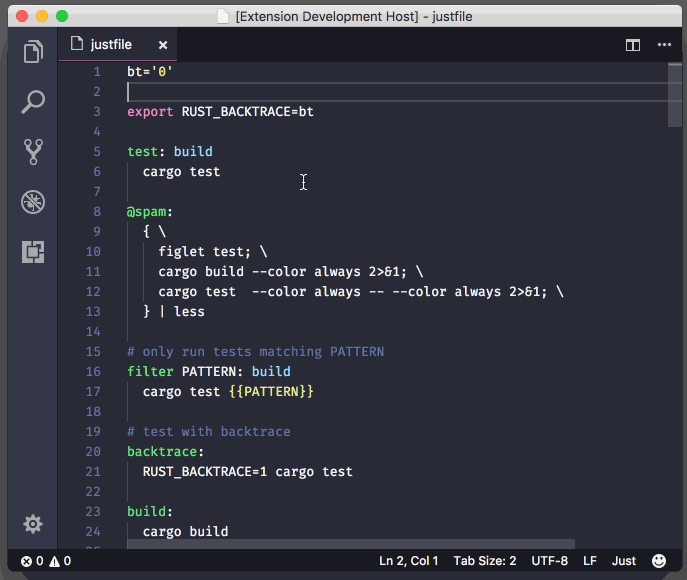

# just

A `Just` language syntax for colourizing your `justfile`s.




# What is Just?

Just is a task runner. It's a single binary with no dependencies. Small & fast.

[Read more](https://github.com/casey/just) about it on their github page.


# Just Basics

You:

* create a file in your project directory called `justfile`
* add some recipes
* then run with `jest my-recipe` from the command line

Here's a super quick and unhelpful example of a `justfile`:

```just
# behold a recipe
fun:
  echo "hi" > tmp.txt
  cat tmp.txt
  rm tmp.txt

# they can have dependencies
superfun: fun
  echo "woah that was fun!"

# and support other inline scripts
js:
  #!/usr/bin/env node
  console.log('woah, seriously?')

# great for pulling of things that are hard in the shell
ruby:
  #!/usr/bin/env ruby
  puts "yep."

```
